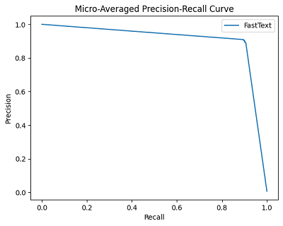
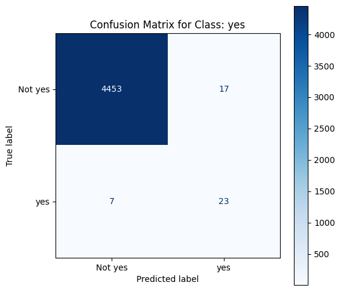

# CLINC150-Text-Classification
 Text Classification with CLINC150 Dataset, using various models including  a finetuned RoBERTa-base 
 
## Project Description  
This repository contains the implementation and analysis of intent detection on the **CLINC150 dataset**, which includes 150 real-world intents. The project compares classical machine learning models (e.g., Naive Bayes, SVM), embedding-based approaches (FastText), and transformer-based models (RoBERTa). Key highlights:  
- Achieved **96.22% accuracy** with fine-tuned RoBERTa-base.  
- Explored synthetic data augmentation using **In-Context Data Augmentation (ICDA)** and **Pointwise V-Information (PVI)** filtering.  
- Comprehensive evaluation of model performance, including macro F1, precision, recall, and confusion matrices.  

## Dataset  
**CLINC150** is a balanced dataset with 15,000 training, 3,000 validation, and 4,500 test examples. It covers diverse domains such as banking, travel, and utilities.  

## Results  

### Model Performance Comparison  
| Model              | Test Accuracy | Macro F1 | Training Time (GPU/CPU) |  
|--------------------|---------------|----------|-------------------------|  
| Naive Bayes        | 81.62%         | 81.27%    | ~10 seconds (CPU)        |  
| FastText           | 90.07%         | 90.02%    | ~1 minute (CPU)       |  
| **RoBERTa-base**   | **96.22%**     | **96.22%**| 10+ hours (GPU)         |  
| RoBERTa + ICDA+PVI | ~96.0%*       | -        | 17+ hours (GPU)         |  

*Adding synthetic data with ICDA+PVI (GPT-2 generated + PVI filtered) did not improve accuracy, likely due to using a smaller generator (GPT-2) and base model constraints.*  
---

### Visual Results  

#### 1. **Precision-Recall Curves**  
Micro-averaged precision-recall curves for each model:  

#### 1. **RoBERTa-base**  
Highest average precision (AP = 0.98), maintaining near-perfect precision even at high recall.  
  

#### 2. **FastText**  
Moderate performance with gradual precision-recall trade-off.  
  

#### 3. **Naive Bayes (TF-IDF)**  
Steepest decline in precision as recall increases, reflecting weaker class separation.  
  

---

#### 2. **Accuracy and Metrics Bar Plot**  
Comparison of Accuracy, F1, Precision, and Recall for the three main models:  
  

---

#### 3. **Accuracy Across All Models**  
Bar plot showing test accuracy for all explored models:  
- Classical ML (Naive Bayes, Logistic Regression, SVM, Random Forest, Multilayer Perceptron)  
- FastText  
- RoBERTa-base  

  

---

#### 4. **Class-Level Confusion Matrices**  
Best and worst classes (by recall) for each model:  

| Model           | Best Class (Recall)       | Worst Class (RE)      |  
|-----------------|------------------------------|-------------------------------|  
| **Naive Bayes** | `travel_alert` (92%)         | `yes` (63%)                   |  
| **FastText**    | `meaning_of_life` (100%)     | `yes` (72%)                   |  
| **RoBERTa**     | `meaning_of_life` (100%)     | `credit_score` (88%)          |  

**Confusion Matrix Examples**:  
- **Best Class (RoBERTa)**: `meaning_of_life`  
    

- **Worst Class (FastText)**: `yes`  
    

---

### Key Observations  
1. **Transformer Superiority**:  
   - RoBERTa-base outperformed classical models by **~15% accuracy** and FastText by **~6%**, demonstrating transformers’ ability to capture contextual nuances.  
   - Achieved near state-of-the-art (SOTA) performance (**96.2%**), comparable to RoBERTa-large (96.8% in literature).  

2. **Class-Level Analysis**:  
   - **Best Class**: `meaning_of_life` (100% precision and recall).  
   - **Worst Class**: `yes` (lower performance due to ambiguous short queries).  

3. **Data Augmentation Challenges**:  
   - ICDA+PVI required significant computational effort but yielded no gains, highlighting the importance of generator model size (e.g., OPT-66B vs. GPT-2).  

4. **Efficiency Trade-offs**:  
   - Classical models (e.g., Naive Bayes) trained in minutes but plateaued at **81–85% accuracy**.  
   - FastText provided a **6–7% boost** over TF-IDF models with subword embeddings.  

For detailed metrics (precision, recall curves, confusion matrices), see the [project report](CLINC150%20Intent%20Detection%20Final%20Report.docx.pdf).  
